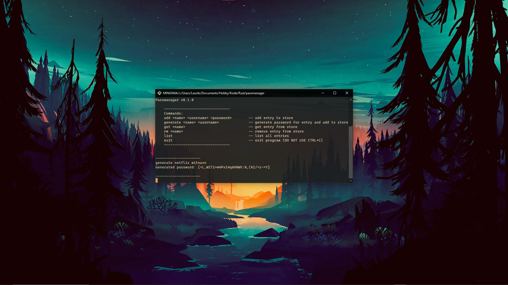

# Passmanager V0.1

## Description

Short project implementing an ultra-simple password manager in Rust with the following features:

- Password hashing with SHA2 and salt
- Password encryption with AES256-GCM
- Serialized password storage using Serde-JSON.
- Password generation

## Motivations

I wanted to familiarize myself with the cryptography ecosystem in Rust, as well as the general application of cryptographic algorithms. The experience gained is relevant to strengthen my full-stack developer profile.
_This manager is **not** intended for real-world use._

## Omissions

Some important features are omitted from this project, as they are not the focus of the project. Most are relatively minor or trivial additions. Omissions include:

- No zeroization of sensitive data
- No password strength checking
- Password length not configurable.
